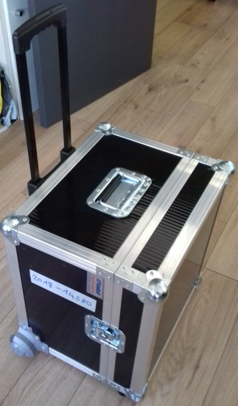

**The KoomBook kit is a mobile multimedia resource that has been designed to serve isolated communities in challenging environments. Its autonomy, durability, and mobility enable deployment in most locations affected by a crisis.  The KoomBook kit:**

[plugin:youtube](https://www.youtube.com/watch?v=_lKFFAwsoCw)

* Can be set up in any environment, indoor or outdoor.
* Can be part of a mobile unit in outreach programs, where a team of facilitators can use it to provide access to information in remote or isolated communities.
* Can be set up in a fixed location that is easily accessible by the community, such as a library, community center, supplies distribution spot, park, etc.  Volunteers or staff facilitators can use it to provide access to information and create a social hub.
* Can currently be used to connect 10 people at a time to the internet. Tests will be conducted to create a kit with broader range, potentially allowing for up to 50 simultaneous users.
* Has been designed to resist high temperature and dust.

