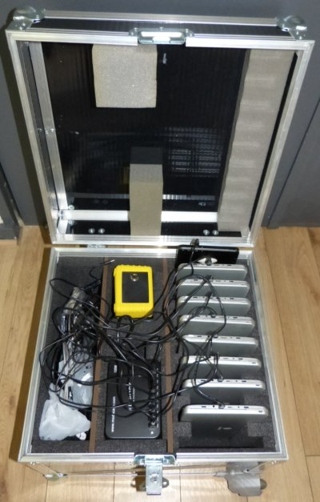

The flightcase is built with POLYTCASE® technology.

> The POLYTCASE® is composed of 10mm-thick honeycomb polycarbonate panels instead of the 5 layers of betonnex or laminated plywood traditionally used.
> Polycarbonate panels are glued in double interlocking aluminum angles. Traditional plywood products are usually simply nailed or stapled. Riveted corners increase the visual appeal of the case. 
> 
> POLYTCASES® are also up to 3 times lighter than traditional cases, ensuring savings on transportation, particularly by air.

source : [J.P'emBall](http://www.jpemball.fr)

**Flightcase details : **

We have four customized models that we use.  

| **Flight-case 1:**   | Black, semi-gloss, cellular polycarbonate panels with aluminum frame |
| --------------------- | ------------------------------------------------------------ |
| Transportation            | 2 embedded handles on sides + 1 telescopic handle + 2 wheels |
| Locks            | 2 butterfly locks on one side (one padlockable) + 2 hinges on other side |
| Electricity and Padding           | 1 power socket (loaded and equipped with electrical connection) to charge KoomBook and tablets in closed position + pre-cut foam |
| Fits           | 7 to 10 tablets, KoomBook, charging unit, equipment |
| Interior Dimensions | 45 x 43 x 35 (26+8) cm [length x width x height]        |
| Weight                | 9 kg (empty) - 16kg (full)                                 |

 

------

| **Flight-case 2:**   | Black, semi-gloss, cellular polycarbonate panels with aluminum frame |
| --------------------- | ------------------------------------------------------------ |
| Transportation             | 2 embedded handles on sides + 1 telescopic handle + 2 wheels |
| Locks            | 2 butterfly locks on one side (one padlockable) + 2 hinges on other side |
| Electricity and Padding        | 1 power socket (loaded and equipped with electrical connection) to charge KoomBook and tablets in closed position + pre-cut foam |
| Fits          | 7 to 10 tablets, KoomBook, charging unit, equipment |
| Interior Dimensions | 51 x 43 x 35 (26+8) cm [length x width x height]        |
| Weight                | 9 kg (empty) - 16kg (full)                                 |

  

------

| **Flight-case 3:**   | Black, semi-gloss, cellular polycarbonate panels with aluminum frame |
| --------------------- | ------------------------------------------------------------ |
| Transportation              | 2 embedded handles on sides + 1 telescopic handle + 2 wheels |
| Locks            | 2 butterfly locks on one side (one padlockable) + 2 hinges on other side |
| Electricity and Padding           | 1 power socket (loaded and equipped with electrical connection) to charge KoomBook and tablets in closed position + pre-cut foam |
| Fits           | 7 to 10 tablets, KoomBook, charging unit, equipment |
| Interior Dimensions | 72 x 43 x 35 (26+8) cm [length x width x height]        |
| Weight                | 14 kg (empty) - 25kg (full)                                |

  

------

| **Flight-case 4 :**   | Black, semi-gloss, cellular polycarbonate panels with aluminum frame |
| --------------------- | ------------------------------------------------------------ |
| Transportation              | 2 embedded handles on sides + 1 telescopic handle + 2 wheels |
| Locks            | 2 butterfly locks on one side (one padlockable) + 2 hinges on other side |
| Electricity and Padding           | 1 power socket (loaded and equipped with electrical connection) to charge KoomBook and tablets in closed position + pre-cut foam  |
| Fits           | 15 tablets, KoomBook, 2 charging units, laptop, video projector, and equipment |
| Interior Dimensions | 82 x 43 x 35 (26+8) cm [length x width x height]        |
| Weight                | 14 kg (empty) - 25kg (full)                                |

### Approximate Size of Materials:

* Tablets: 260x155x20mm
* Koombook: 230x116x84mm
* 10-port usb charger: 155x110x38mm
* Video projector: 270x290x100mm
* Laptop: 380x270x27mm