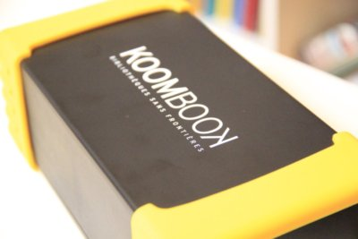

The KoomBook is a portable, battery-operated server that displays videos, documents, images and offline websites using a WiFi hotspot.

It is made of several pieces of hardware designed to provide electrical autonomy, storage, and WiFi capability:

- A single-board computer (1Ghz dual core processor and 1GB of RAM) to run an operating system.
- Linux stored on a SD card and installed on the board.
- An SSD drive to store data.
- A Lipo battery charger that automatically regulates the battery charge and ensures the board has enough power s.
- 1 WiFi dongle to create the hot spot
- 1 WiFi dongle to bridge the KoomBook to an existing WiFi hotspot that is connected to the internet

**How It Works**

- The KoomBook emits a close-range WiFi signal (up to 50m).
- Users can connect to the WiFi with a wide range of devices including telephones, tablets or computers.
- Users can use any existing web browser to easily navigate the server (see IdeasCube below)
- Users can browse and download content as well as share their own .
- When the KoomBook is connected to the internet, it uploads all locally created content to the cloud.

[Build a KoomBook on your own](http://assemblage-koombook.doc.bibliosansfrontieres.org/fr)