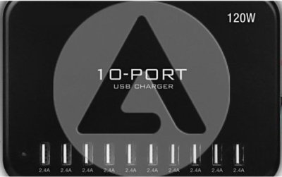
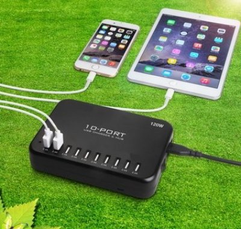

 

The USB charger is 220V -> 5V converter that is able to charge up to 10 device at the same time. 

* Imput power AC 110V/220V - 1.68A	
* Output power DC 5V 2.4A * 10
* Size : 156 x 109 x 33 mm
* Weight : 465 g

The maximum output intensity from each port is around 2.4A 

Main supplyer : [Abylon](http://www.abylon.fr/)