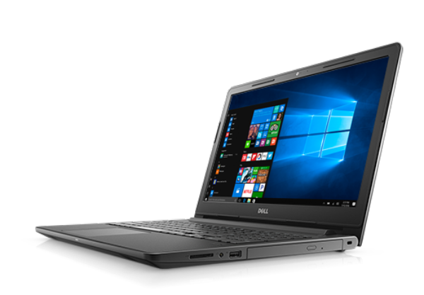

```
Vostro 15 3568
Size: 15.6"
Screen resolution: 1366 x 768 (HD)
CPU: Intel Core i3 (6th gen) 6006U / 2.2 GHz / 3 Mo Cache
RAM: 4 Gb or 8Gb
Hard Disk Drive: 500Gb / 5400t/min - or 256Gb M.2 SATA SSD Class 20
Optical Drive: DVD+RW
Graphic card: Intel HD Graphics 520
Ports:
        - 2 x USB 3.0
        - USB 2.0
        - Gigabit LAN
        - HDMI
        - VGA
        - Mic/headphone jack combo
Operating System: Windows 10 pro 64bit French or US + Edubuntu 16.04 (dual boot)
Size: 380x260x24mm
```

[See official website](http://www.dell.com/fr-fr/work/shop/les-ordinateurs-portables-dell/vostro-15-3000/spd/vostro-15-3568-laptop)
