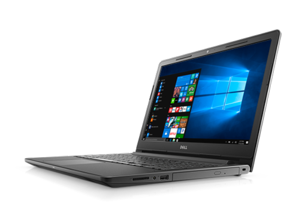

```
Vostro 15 3568
Taille : 15.6"
Résolution d'écran : 1366 x 768 (HD)
CPU: Intel Core i3 (6th gen) 6006U / 2.2 GHz / 3 Mo Cache
RAM: 4 Gb or 8Gb
Stockage : 500Go / 5400t/min - ou 256Go M.2 SATA SSD Class 20
Lecteur CD : DVD+RW
Carte graphique: Intel HD Graphics 520
Ports :
        - 2 x USB 3.0
        - USB 2.0
        - Gigabit LAN
        - HDMI
        - VGA
        - Combiné micro/écouteurs
Systèmes d'exploitation : Windows 10 pro 64bit Français ou US + Edubuntu 16.04 (dual boot)
Size: 380x260x24mm
```

[Voir sur le site officiel](http://www.dell.com/fr-fr/work/shop/les-ordinateurs-portables-dell/vostro-15-3000/spd/vostro-15-3568-laptop)
