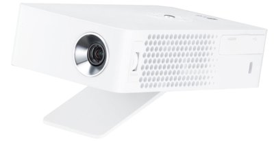
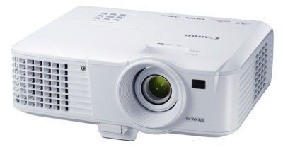

There are two types of video projectors available depending on your needs.

## Light & Portable

Projector with built-in battery (~4 hours) and RGB LED light (around 250 lumens).

This type of projector can cover basic needs and show content to a small group of people. For best results, the room must be dark. 

Model: [LG PH30JG](http://www.lg.com/fr/video/lg-PH30JG-videoprojecteur)  

## Bigger & Brighter

For other needs, the bigger projector delivers brighter and higher quality images (3200 lumens).  It relies on the main power supply and can’t run on battery.

This equipment is especially handy for class, movies, etc.

Model: [CANON LV-WX320](https://www.canon-europe.com/for_home/product_finder/multimedia_projectors/lv/lv_wx320/)

