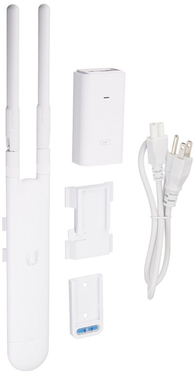
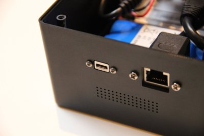

The built-in WiFi hotspot in the KoomBook has limited capability due to its hardware design. The hardware responsible for the WiFi is small and the antenna is only a half centimeter long. There are no significantly better alternatives at the moment.

As a result: 

* Only 10 concurrent connections are possible on the WiFi hotspot
* Data transfer rate is limited
* WiFi coverage is limited

To overcome these limitations, we can use an external antenna. This hardware performs very well as an autonomous WiFi hotspot and extends the range of the KoomBook.

## WiFi Antenna

Current WiFi antennas can extend the coverage up to 200m and handle more than 200 simultaneous users. Most of them can operate on 2.4Ghz and 5Ghz. The theoretical data rate is around 300Mbps in 2.4Ghz and 867Mbps in 5Ghz.

The [Ubiquiti UniFi Mesh UAP-AC-M 802.11ac](https://unifi-mesh.ubnt.com/#home) offers a good and reliable hardware & software solution.

This product operates as a mesh network with several antennas connected to each other through a "cloud key" which plays the role of the main controller. 

For basic needs, one antenna is often enough.  In this case, the system can be configured with a simple [Android application](https://play.google.com/store/apps/details?id=com.ubnt.easyunifi&noprocess), eliminating the need for a cloud key controller. 

The Android application has limited features and the only settings available are:

* hotspot name
* security 
* channels
* additional general settings

The antennas operate in bridge mode and will forward all the traffic from the user to the KoomBook. 

## KoomBook

In order to extend the WiFi coverage through the use of an external antenna, the latter must be connected to the KoomBook with an Ethernet cable to the RJ45 outlet on the rear of the box.

The KoomBook software has been designed to work with an external antenna and the connection can be established by [a single line in a configuration file](https://github.com/ideascube/ansiblecube/blob/oneUpdateFile/roles/set_custom_fact/files/device_list.fact#L8105).

The KoomBook can be configured [two different ways](https://github.com/ideascube/ansiblecube/blob/oneUpdateFile/roles/network-manager/files/add-IP-address-for-external-antenna.sh) depending on the location and context:

* Option 1: The KoomBook is connected to a local Ethernet network with a router and maybe an Internet connection. In this case, the KoomBook: 
  * switches to dynamique IP
  * receives an IP address from the local DHCP server
  * is ready to communicate with the rest of the world
* Option 2: The KoomBook is connected to the WiFi antenna. In this case, the KoomBook: 
  * switches to static mode 
  * sets a static IP address
  * restarts DHCP/DNS service 
  * is ready to ditribute an IP address to the WiFi antenna
  * is ready to communicate with the antenna and the local user