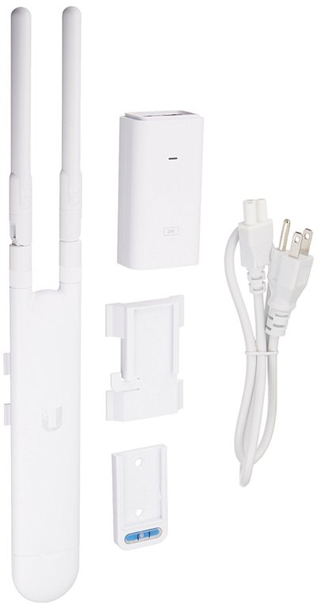

The built-in wifi hotspot in the KoomBook has limited capability due to hardware design. Indeed, the hardware responsible for the wifi is small and the antenna mesure half centimeter. There is no real alternative for a much better hardware. 

The consequences are : 

* Only 10 concurents connexions on the wifi hotspot
* Limited data transfert rate
* Limited wifi coverage

To overcome this limitation, we can make us of an external antenna. Dedicated hardware perfom very well as autonomous wifi hotspot and extend the range of the content provided by the KoomBook

## Wifi antenna

Current wifi antenna can extend the coverage up to 200m and handle more than 200 simultaneous users. Most of them can operate on 2.4Ghz and 5Ghz. The theoritical data rate is around 300Mbps in 2.4Ghz and 867Mbps in 5Ghz.

The [Ubiquiti UniFi Mesh UAP-AC-M 802.11ac](https://unifi-mesh.ubnt.com/#home) offer a good and reliable hardware & software solution.

This product has been made to operate as a mesh network with several antenna connected to each other through a "cloud key" which play the role of the main controler. 

For basic needs, one antenna is often enough. It can be configured with a simple [Android application](https://play.google.com/store/apps/details?id=com.ubnt.easyunifi) instead of buying a cloud key controler. 

The Android application has limited feature and only few settings are available

* hotspot name
* security 
* channels
* some informationnal overview

The antenna operate in bridge mode and will forward all the traffic from the client to the KoomBook. 

## KoomBook

In order to extend the wifi coverage through the use of an external antenna, the latter must be connected to the KoomBook with an Ethernet cable to the RJ45 outlet on the rear of the box.

The KoomBook software has been design to work with an external antenna and today, it is a matter of [a line in a configuration file](https://github.com/ideascube/ansiblecube/blob/oneUpdateFile/roles/set_custom_fact/files/device_list.fact#L8105) to setup the confguration.

However, in the background, the [KoomBook must handle two configuration context](https://github.com/ideascube/ansiblecube/blob/oneUpdateFile/roles/network-manager/files/add-IP-address-for-external-antenna.sh)

* The KoomBook is connected to local Ethernet network with a router and maybe an Internet connexion, in this case, the KoomBook 
  * switch to dynamique IP
  * receive an IP address from the local DHCP server
  * is ready to communicate with the rest of the world
* The KoomBook is connected to the wifi antenna, in this case, the KoomBook 
  * switch in static mode 
  * set a static IP address
  * restart DHCP / DNS service 
  * is ready to ditribute an IP address to the wifi antenna
  * is ready to communicate with the antenna and the local client