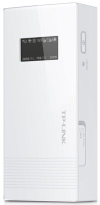
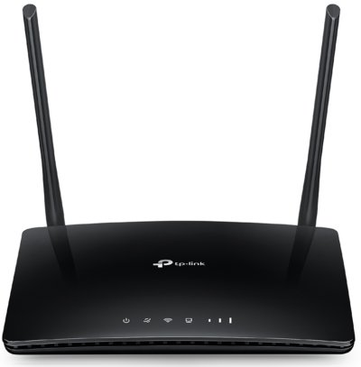
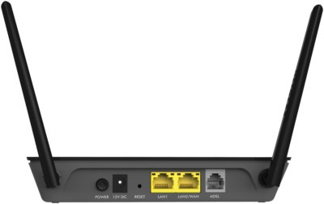
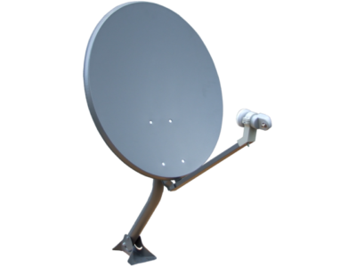

Eventough the main goal of this kit is to work offline and in some area where no Internet connexion is available. It can be usefull from time to time to be able to connect one of those devices to Internet.

Reasons can be one of the following

* Content update 
* Software update
* Maintenance
* Etc.

For those reasons, we use several type of connexion depending on the context

## Cybercafé

Interesting when you are close to a city and if you want to save up some money. The easiest way to get connected is the cybercafé. For instance, the KoomBook is able to conenct to a wifi hotspot to get an upgrade. 

You don't have to purchase any data connexion or hardware

## 3G/4G mobile data connexion

If available, the mobile data connexion is quite handy. This can be achieve with a 3G Mobile Wi-Fi router. Some of this device are equipped with a built-in 3G or 4G modem (you don't have to buy any 3G/4G USB stick). The device re-emit the Internet connexion through a Wifi hotspot available for the users.

The portable (works on battery) version of this device can handle up to 10 users connected at the same time, while high-end product (main supply needed) can handle several dozen of users. 

### Mobile

We have tested succesfully the [TP-LINK M5360 3G wifi router](https://www.tp-link.com/en/products/details/cat-14_M5360.html) which is a really good product for the KoomBook kit. 

> > > > > Even tough the device can work in your area, make sure the latter can work and deal with the local Internet provider. Some time, frequency or local Internet provider configuration might not be compatible with the product. Best is to buy locally !

If available, you can use the 4G version : [TP-LINK M7310](https://www.tp-link.com/en/products/details/cat-4692_M7310.html)

### Fixed

If needed, the fixed version (must be connected to a main power supply 100v/220v)

* can handle more users at the same time
* have a better bandwitch 
* better wifi coverage

[TP-LINK TL-MR6400](https://www.tp-link.com/en/products/details/cat-4691_TL-MR6400.html) without 3/4G modem (must be buy separatly)

[Huawei B315S-22](https://consumer.huawei.com/ie/support/smart-home/b315s-22/)

### Find the right data plan

Etheir you choose a mobile or fixed 3G/4G router, you will need then to choose an Internet provider, in this case, you have to lookfor mobile data provider. Each country as it owns, with good and bad deals. 

In France, for instance, we have this [website comparator](https://www.choisirsonforfait.com/forfait/compa ratif.php) that can help in making the right decision. Few things you have to consider before making you choice : 

* Is the area covered by the local provider 

  * Go on this area with a smartphone with a simcard of this provider and check is the coverage and the connexion quality is good enough for you projet

* Does the provider can provide an unlimited data transfert or a limited data transfert. You will have to estimate how much data you need, per day, per month, etc. 

  * In some country the Internet provider can sell unlimited 3G/4G connexion, 50GB / monthly

  * In some other, it only sell small voucher of 1GB to 10GB, renewable when ever you want.

>>>>> Make sure the deal feets your need !

### Configure the device

At least you will have to

* Change the admin password
* Personalize the wifi hotspot name
* Initialize your simecard with the device

## Landline connexion

If available, the landline ADSL Internet connexion can be fast and relayable. However in some country this option can be worst than mobile connexion and must be considered as a plan B

## Satelitte

In some case the satelitte connexion is the best option as there is nothing around that can provide any Internet connexion. 

You will have to checkout locally what provider is available.

For instance, in Burundi, [OptiLINK Ku](http://www.iec-telecom.com/product/optilink-ku/) satelitte solution can be use. It provide a limited Internet connexion with up to 15GB of data per month