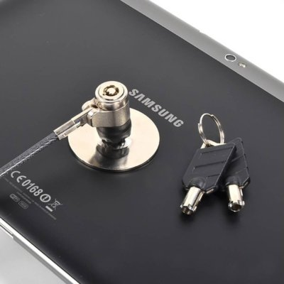

Tablet locks keep the tablets secure and allow them to be used even when no facilitator is present. The lock is bonded to the rear of the tablet, right in the middle so the tablet doesn’t wobble when laid on its back.

Several brands are available on the market but are usually expensive: ~ 43€