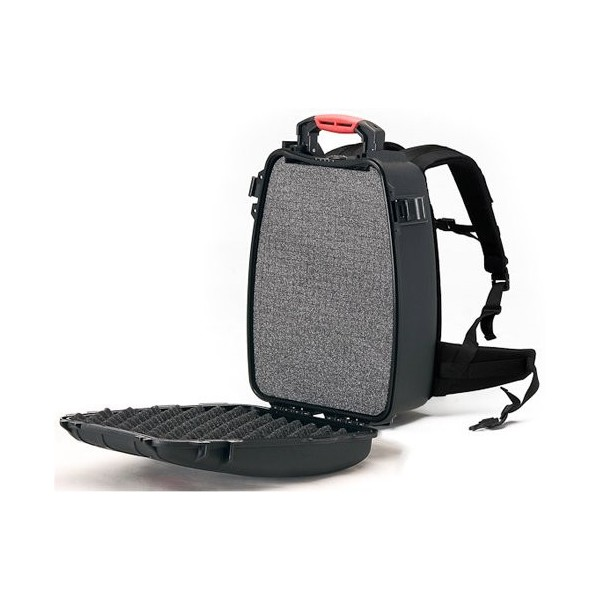

A backpack is a great alternative for carrying around all or part of this kit. As a matter of fact, some remote places are quite hard to reach by car, but relatively easy by foot. 

This is a plausible solution because the total weight should not be above 12-15 Kg.

| Resource                                                     | Weight (Kg)    |
| ------------------------------------------------------------ | -------------- |
| [1 Ideascube](http://koombook-kit.doc.bibliosansfrontieres.org/kit-inventory/koombook) | 655g            |
| [10 tablets](http://koombook-kit.doc.bibliosansfrontieres.org/kit-inventory/tablet) | 10 x 0.47 = 4.7 Kg |
| [1 solar kit](http://koombook-kit.doc.bibliosansfrontieres.org/kit-inventory/solar-kit) | 2 Kg            |
| [1 pico video projector](http://koombook-kit.doc.bibliosansfrontieres.org/kit-inventory/video-projector) | 0.5 Kg          |
| [1 USB charger (10 ports)](http://koombook-kit.doc.bibliosansfrontieres.org/kit-inventory/usb-charger) | 0.5 Kg          |
| [1 backpack](http://www.abylon.fr/valise-etanche-hprc/166-valise-hprc-3500.html) | 3.5 Kg          |
| Divers, cable                                                | 0.5 Kg          |
| **Total**                                                    | **~12 Kg**     |

The backpack can be any brand, but special attention must be paid to the quality of the material and the protection it provides as it is going to be used to carry electronics. Heavy duty backpacks are best!

Some backpacks are specially made for electronics, such as this one: 

